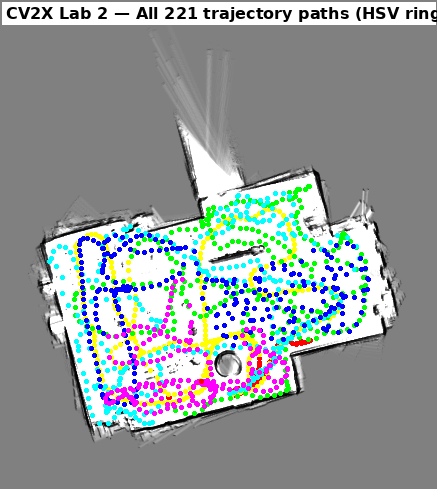
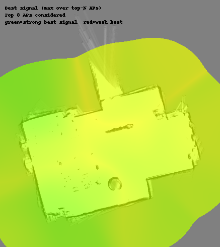
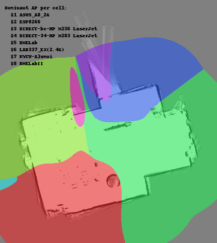
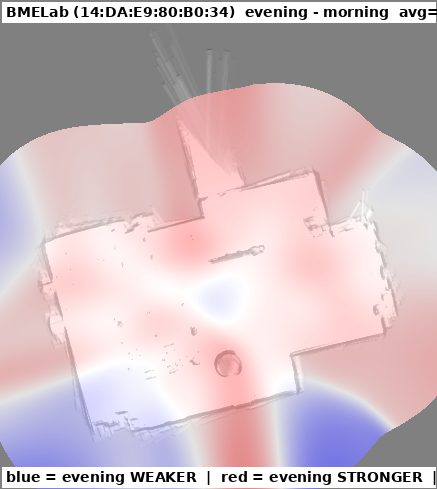
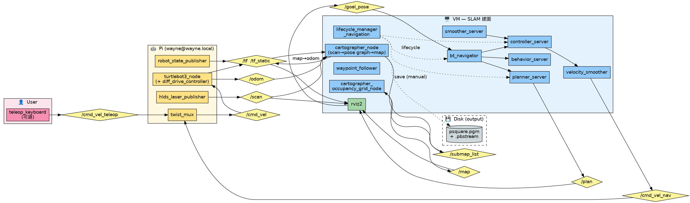
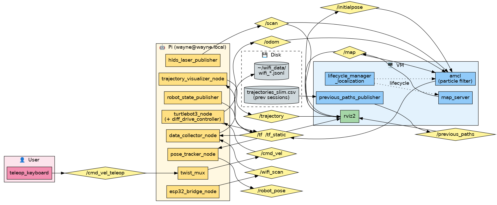

# CV2X Lab 2 — WiFi Fingerprint Indoor Localization

TurtleBot3 burger + LDS-01 + ESP32-S3 室內 WiFi fingerprint dataset。
NYCU CV2X Lab 2 完整交付。

- 完整報告:[REPORT.md](REPORT.md)
- 重現指南:[SETUP.md](SETUP.md)
- 簡報講稿:[PRESENTATION.md](PRESENTATION.md)
- 簡報投影片:[CV2X_Lab2_presentation.pptx](CV2X_Lab2_presentation.pptx)(27 張)

> **Lab 3(下游):用這份 dataset 做深度學習室內定位** → [code/lab3/](code/lab3/)
> 從 KNN baseline 1.57 m 一路到 coarse-to-fine cascade **0.79 m**,並在實驗室即時 demo。
> 演進故事 [EVOLUTION.md](code/lab3/EVOLUTION.md)、簡報 [lab3_journey.pptx](code/lab3/outputs/slides/lab3_journey.pptx)。

## 蒐集數字

| | 早 (5/17) | 晚 (5/23) | 合計 |
|---|---:|---:|---:|
| WiFi-pose record | 912 | 900 | 1,812 |
| AP detection | 24,359 | 25,837 | 50,196 |
| Paths (30s 切) | 113 | 108 | 221 |
| Avg AP / scan | 26.7 | 28.7 | 27.7 |
| Unique BSSID | 89 | 102 | 115 |

bbox 15.97 × 11.87 m = 189.5 m²。

## 視覺化(github 直接看)

| 早上軌跡 | 晚上軌跡 |
|:---:|:---:|
|  |  |
| **全 221 條合併** | **RSSI combined-best** |
|  |  |
| **Dominant AP** | **早晚 RSSI 差異(BMELab +2.6 dBm)** |
|  |  |

## ROS 架構

| SLAM 階段 | AMCL 蒐集階段 |
|:---:|:---:|
|  |  |

## 為什麼這樣設計

兩階段拆開,先 SLAM 建一張固定地圖,再 AMCL 純定位邊走邊收 wifi。
原因:同一個物理位置在所有 record 中對應同一個座標,fingerprint 才有意義。
邊 SLAM 邊收的話 map frame 會持續微調,前後 record 配的座標不一致。

wifi-pose 對齊用 `lookup_transform(target, source, msg.header.stamp)`,
不是常見的 `rclpy.time.Time()`(最新 TF)。
ESP32 scan 要 ~3.8 秒,用最新 TF 等於配給「scan 結束後又走了一段」的位置,~1 m 偏移。
ESP32 firmware 端再把 stamp 設成 `now - scan_dur/2`,等於把那筆 scan 對應到「中段」位置。

跨機 ROS 2 用 CycloneDDS,不是預設的 FastRTPS。
FastRTPS 在 WiFi 上 multicast 不可靠,跨機 /tf 會掉,SLAM 跟 AMCL 都會掛。

T 秒切片可調(`--split-by-time T`),直接對應 spec 要求的 "軌跡為 T 秒,可設定參數"。

## Quick start

```bash
# 建圖
ros2 launch code/lab2.launch.py

# 蒐集
ros2 launch code/lab2_amcl.launch.py

# 後處理
cd code
python3 jsonl_to_csv.py --split-by-time 30
python3 make_rssi_heatmap.py
python3 make_morning_evening_diff.py
python3 make_trajectory_split.py
python3 make_trajectory_overlay.py
```

詳細看 [SETUP.md](SETUP.md)。

## License

MIT,見 [LICENSE](LICENSE)。
