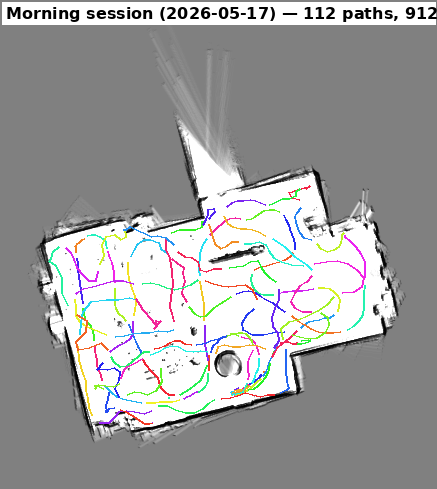
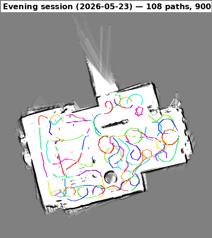
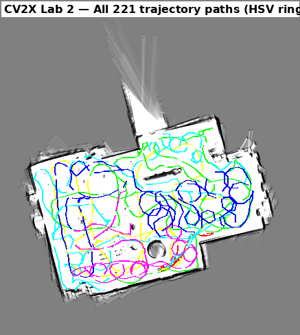
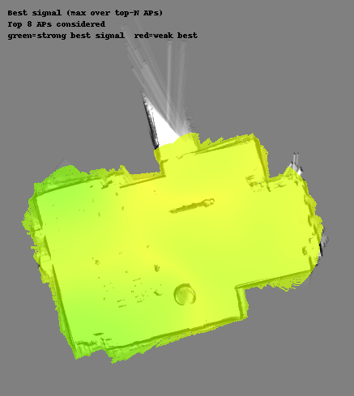
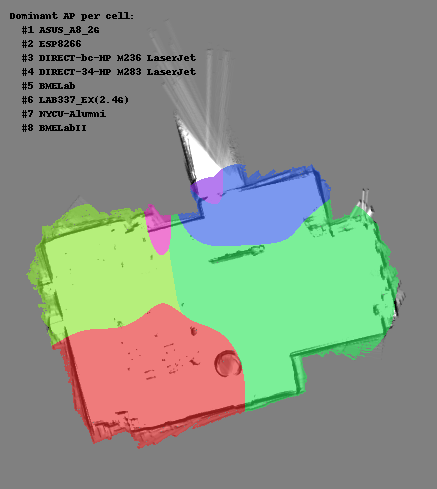
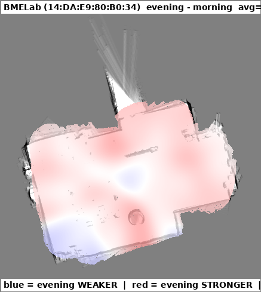

# CV2X — WiFi 室內定位(資料蒐集 + 深度學習)

NYCU CV2X 課程專案,分兩階段:

- **Lab 2 — 蒐集**:TurtleBot3 burger + LDS-01 + ESP32-S3,在 Lab 338(189.5 m²)
  邊定位邊掃 WiFi,做出一份 1,812 筆的 (RSSI, pose) 指紋資料集。
- **Lab 3 — 使用**:用這份資料訓練室內定位模型,從 KNN baseline 的中位誤差
  1.57 m 一路做到 coarse-to-fine cascade,中位誤差 **0.752 m**(Split A 隨機
  80/20、標準 train→test)。最後接 ESP32 在實驗室即時 demo。

## 專案結構

```
.
├── lab2/                ROS 蒐集程式、架構圖、視覺化、報告、簡報
├── lab3/                深度學習模型、即時 demo、圖表、簡報
├── map/                 SLAM 樓層平面圖 ── 共用
├── wifi/                原始指紋 jsonl ── 共用(lab2 產、lab3 讀)
├── trajectories/        表格化軌跡 CSV ── 共用
├── README.md            (本檔)
└── LICENSE
```

每個資料夾都有自己的 README 說明內容與格式。

## 兩個 Lab

| | Lab 2 — 蒐集 | Lab 3 — 定位 |
|---|---|---|
| 做什麼 | 開機器人收 WiFi 指紋資料集 | 用資料集訓練定位模型 |
| 入口 | [lab2/README.md](lab2/README.md) | [lab3/README.md](lab3/README.md) |
| 報告 | [lab2/REPORT.md](lab2/REPORT.md) | [lab3/LAB3_REPORT.md](lab3/LAB3_REPORT.md) · [技術報告](lab3/TECHNICAL_REPORT.md) |
| 故事 | [lab2/PRESENTATION.md](lab2/PRESENTATION.md) | [lab3/EVOLUTION.md](lab3/EVOLUTION.md)(演進史) |
| 簡報 | [pptx](lab2/CV2X_Lab2_presentation.pptx)(27 張) | [lab3_presentation.pptx](lab3/outputs/slides/lab3_presentation.pptx)(33 張)+ [講稿](lab3/outputs/slides/PRESENTATION_SCRIPT.md) |
| 一鍵跑 | — | skill [`/run-lab3`](lab3/.claude/skills/run-lab3/)(reproduce / demo / screenshot) |

## 資料集(共用,在根目錄)

| | 早 (5/17) | 晚 (5/23) | 合計 |
|---|---:|---:|---:|
| WiFi-pose record | 912 | 900 | 1,812 |
| AP detection | 24,359 | 25,837 | 50,196 |
| 軌跡段 (30s 切) | 113 | 108 | 221 |
| Unique BSSID | 89 | 102 | 115(取 ≥10 次的 80 個當特徵) |

bbox 15.97 × 11.87 m = 189.5 m²。格式說明見
[`wifi/`](wifi/)、[`trajectories/`](trajectories/)、[`map/`](map/)。

## Lab 3 成果(Split A 隨機 80/20 測試,363 筆)

| 模型 | 中位誤差 | 重點 |
|---|---:|---|
| KNN k=5 | 1.568 m | 經典 fingerprinting 基準線 |
| Set Transformer MDN | 1.093 m | 變長集合輸入 |
| + GP 合成資料 | 0.906 m | 填補空間覆蓋缺口(單一最大進步)|
| Heatmap + free-mask ×5 | 0.883 m | 分類取代回歸 |
| Cascade ×5-ens | 0.793 m | 粗網格守門細網格 |
| **Cascade-aggressive ×5-ens** | **0.752 m** | 調損失權重 ── 冠軍 |

> 表中為標準 train→test 數字(Split A 隨機 80/20)。
> 驗證方法與走過的失敗路線見 [TECHNICAL_REPORT.md](lab3/TECHNICAL_REPORT.md)。

完整演進(含 8 個失敗路線)見 [lab3/EVOLUTION.md](lab3/EVOLUTION.md)。

```bash
# 重現數字(用已 commit 的權重,CPU 即可)
cd lab3 && python load_best_model.py                 # tuned 5-seed → median 0.760 m
cd lab3 && python load_best_model.py --variant baseline   # → 0.793 m
# 一鍵 reproduce + demo + 螢幕截圖(run-lab3 skill 的 driver)
cd lab3 && python .claude/skills/run-lab3/driver.py smoke
# 重新產生所有報告/簡報圖表
cd lab3 && python make_report_figures.py             # 圖輸出到 outputs/figures/
# 實驗室即時 demo(ESP32):serial 即時,或無硬體 replay
cd lab3 && python realtime_demo.py --port COM3 --smooth 5
cd lab3 && python realtime_demo.py --replay ../wifi/wifi_20260517_101315.jsonl
```

## 視覺化(Lab 2,github 直接看)

| 早上軌跡 | 晚上軌跡 |
|:---:|:---:|
|  |  |
| **全 221 條合併** | **RSSI combined-best** |
|  |  |
| **Dominant AP** | **早晚 RSSI 差異(BMELab +2.6 dBm)** |
|  |  |

## License

MIT,見 [LICENSE](LICENSE)。
