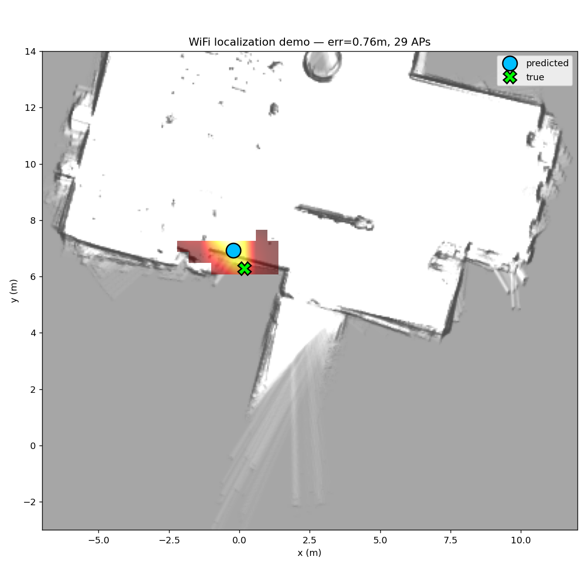

# Real-time WiFi Indoor Localization — Demo

Live-localize yourself in the lab from an ESP32 WiFi scanner, using the
trained Cascade model. Runs on a **laptop, CPU only** (no GPU needed).



> Blue ● = predicted position, green ✕ = true (replay only), hot blob = the
> model's probability heatmap over the floor.

---

## What it does

Each WiFi scan (a list of `(BSSID, RSSI)` from the ESP32) is fed through the
5-seed **Cascade 2-level** ensemble (the winning model, median 0.793 m on
Split A). The script draws your estimated `(x, y)` and the model's confidence
heatmap on the lab floor plan, updating every scan (~3 s, the ESP32 scan time).

Inference is **~9 ms per scan on CPU** — the WiFi scan itself is the only slow
part, so a GPU buys you nothing here.

---

## 1. Setup (on your laptop)

```bash
git clone https://github.com/kmliy901054/cv2x-lab2-wifi-fingerprint.git
cd cv2x-lab2-wifi-fingerprint/code/lab3
pip install -r requirements_demo.txt
```

The repo already contains everything the demo needs:
- `outputs/checkpoints/A_random__Cascade_s4[2-6].pt` — the 5 model weights (~18 MB)
- `outputs/bssids.json` — the 80-BSSID vocabulary (must match training; included)
- `../../map/psquare.yaml` + `.pgm` — the floor plan
- `models.py`, `data.py` — model + grid helpers

It does **not** need the training dataset present.

---

## 2. Try it now — replay mode (no hardware)

Replays a recorded scan log and shows prediction vs. recorded ground truth, so
you can verify everything works before wiring up the ESP32:

```bash
python realtime_demo.py --replay ../../wifi/wifi_20260517_101315.jsonl
```

- A matplotlib window opens and animates the predicted position.
- Headless / no-window check (prints numbers only):
  ```bash
  python realtime_demo.py --replay ../../wifi/wifi_20260517_101315.jsonl --no-viz
  ```

> Note: the bundled recordings were part of training (Split A is a random
> 80/20), so replayed errors look optimistic. The honest test is walking around
> live (below).

---

## 3. Live mode — with the ESP32

Flash/connect the **same ESP32** you used in Lab 2. It must emit one JSON line
per scan over serial, e.g.:

```json
{"scan_duration_ms": 3201, "aps": [{"bssid":"F0:2F:74:E2:C4:A8","rssi":-51}, ...]}
```

(`ssid`, `ch`, `enc` are optional and ignored; only `bssid` + `rssi` are used.)

Find the serial port, then run:

```bash
# Windows — check Device Manager for the COM number
python realtime_demo.py --port COM3

# Linux / macOS
python realtime_demo.py --port /dev/ttyACM0      # or /dev/ttyUSB0, /dev/tty.usbserial-*
```

Optional flags: `--baud 115200` (default), `--device cpu` (default).

Walk around the lab — the blue dot tracks your estimated position and the hot
blob shows where the model thinks you are with what confidence.

---

## 4. How the input is built (must match training exactly)

For each scan the demo:
1. keeps only APs whose BSSID is in `bssids.json` (the 80 trained APs),
2. sorts them by RSSI (strongest first), keeps the top 50,
3. normalizes RSSI as `(rssi + 100) / 20`,
4. builds `(bssid_idx, rssi, mask)` exactly like `data.build_set_input`.

If the ESP32 reports a BSSID the model never trained on, it is simply dropped —
the model only knows the 80 APs from Lab 2.

---

## 5. Troubleshooting

| Symptom | Fix |
|---------|-----|
| `ModuleNotFoundError: serial` | `pip install pyserial` (only needed for `--port`) |
| `No checkpoints found` | Make sure you cloned with the committed `A_random__Cascade_s*.pt` |
| Prediction stuck / very wrong | Check the ESP32 is actually scanning; `APs matched: 0/N` means none of the visible APs are in the trained vocabulary |
| Window doesn't open | Use `--no-viz` to confirm the pipeline runs; check your matplotlib backend |
| Few APs matched | The lab's AP set may have changed since Lab 2; retrain with fresh data if many APs are new |

---

## 6. Limitations (honest)

- The model only knows the **80 APs present during Lab 2 collection**. New/removed
  APs degrade accuracy.
- **Single-scan** localization: ~16% of predictions can be >2 m off due to WiFi
  symmetric ambiguity (two places with similar RSSI). Smoothing across
  consecutive scans (a moving average of the predicted `(x,y)`) visibly steadies
  the dot — the trail in the demo hints at this.
- Coverage bias: Lab 2 sampled the lower half of the room densely and the upper
  open area sparsely, so predictions in the upper area are less reliable.

See [LAB3_REPORT.md](LAB3_REPORT.md) §4.5–4.6 for the full error analysis.
