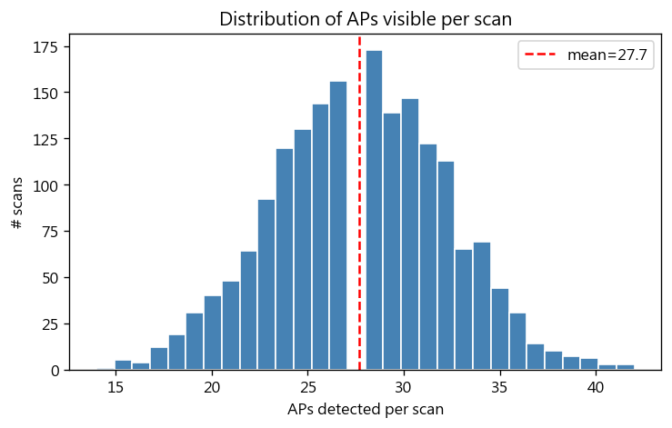
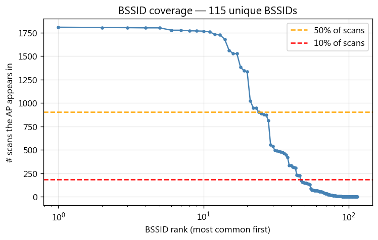
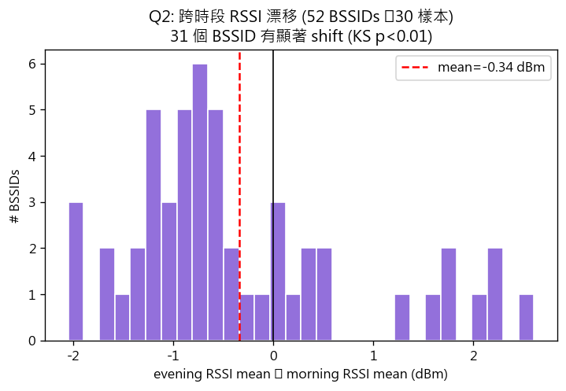
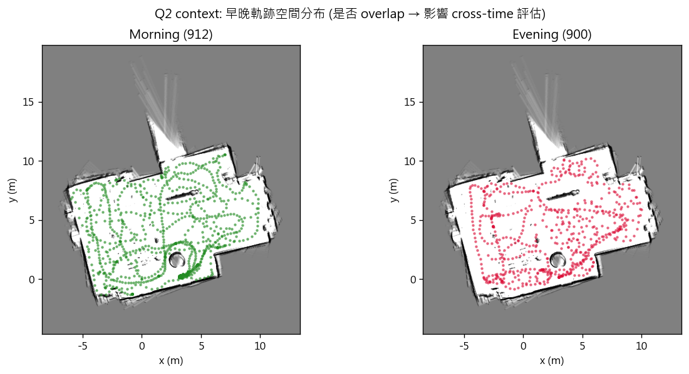
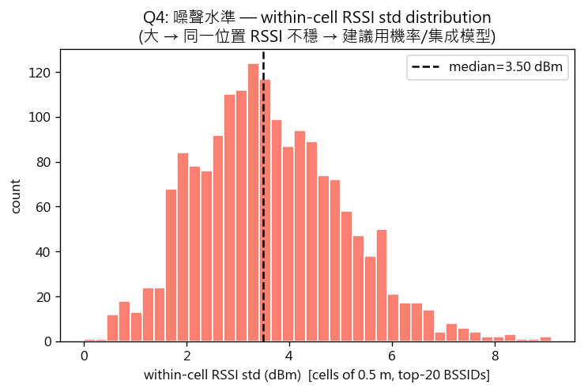
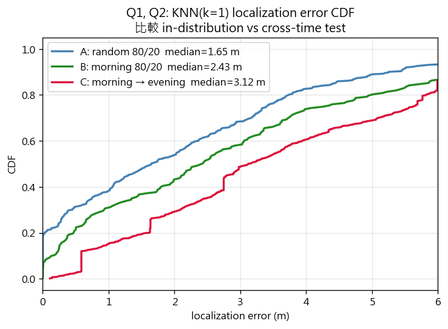
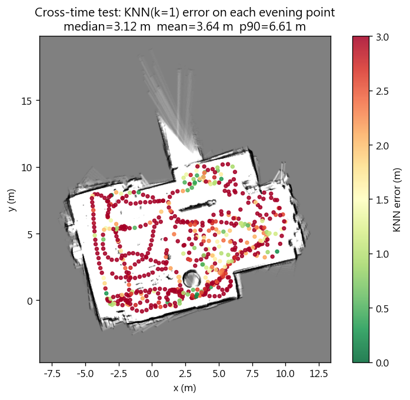
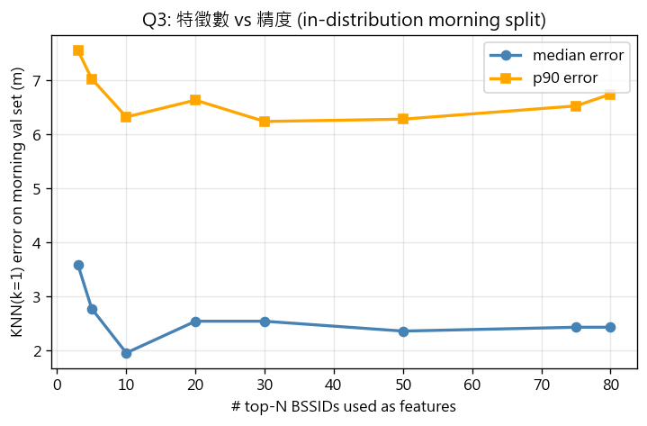

# EDA Report — WiFi Fingerprint Indoor Localization

生成於: 2026-05-26 16:42:03

## 0. 摘要

- **Q1 可學習?** KNN(k=1) 在 in-distribution(morning 80/20)中位數誤差 **2.43 m**;random 全域 split **1.65 m** → 資料有強信號,可學
- **Q2 跨時段影響?** Morning→Evening 中位數誤差 **3.12 m**,比 in-distribution 多 **+0.69 m** (+28%)
- **Q3 BSSID 數?** 特徵 sweep 見表 / 圖 06,通常 top-20 ~ top-50 收斂
- **Q4 噪聲水準?** within-cell RSSI std 中位數 **3.50 dBm**,p90 **5.56 dBm** → 噪聲大,建議用機率/集成模型

## 1. 資料概觀

- 總 record: 1,812  (morning 912 + evening 900)
- 唯一 BSSID: 115
- 每筆 scan 看到 AP 數: mean 27.7 ± 4.5, 中位數 28
- 至少出現 10 次的「有用 BSSID」: **80** 個(將作為主特徵集)

## 2. 跨時段 covariate shift (Q2)

- 共 52 個 BSSID 早晚都 ≥30 樣本
- **31 個 (60%)** 有顯著漂移 (KS test p < 0.01)
- delta 平均: -0.34 dBm,範圍 [-2.05, +2.61]

前 10 大漂移 BSSID:
| ssid                       |   morning_mean |   evening_mean |   delta |     ks_p |
|:---------------------------|---------------:|---------------:|--------:|---------:|
| BMELab                     |         -63.84 |         -61.22 |    2.61 | 5.27e-17 |
| ASUS_A8                    |         -63.92 |         -61.64 |    2.28 | 3.15e-18 |
| ASUS_A8_2G                 |         -56.79 |         -54.54 |    2.25 | 3.69e-30 |
| DIRECT-bc-HP M236 LaserJet |         -59.15 |         -57.09 |    2.06 | 2.31e-26 |
| NYCU-Seminar               |         -80.08 |         -82.13 |   -2.05 | 0.18     |
| NYCU                       |         -83.15 |         -85.11 |   -1.95 | 0.0243   |
| Wiwynn_Lab                 |         -81.88 |         -83.77 |   -1.9  | 9.18e-05 |
| arai_622                   |         -90.12 |         -88.3  |    1.83 | 2.12e-11 |
| ESP8266                    |         -64.13 |         -62.39 |    1.74 | 1.41e-14 |
| NYCU-Alumni                |         -83.11 |         -84.8  |   -1.69 | 0.0625   |

## 3. Within-cell 噪聲 (Q4)

- 把空間切成 0.5 m × 0.5 m cells (≥5 樣本的 cell)
- 對 top-20 BSSID 算每個 cell 內的 RSSI std → 共 1764 個 (cell, bssid) 樣本
- **median: 3.50 dBm,p90: 5.56 dBm**
- 解讀:同一位置同一 AP 的 RSSI 波動有多大
- 跟跨時段 shift(~2.6 dBm)同數量級 → 任何模型都要對 ±2-3 dBm 的雜訊有韌性

## 4. KNN baseline (Q1)

用 cosine 不行(RSSI 用 -100 填會把 missing 拉成「相似」),這裡用 Euclidean。
特徵 = 全部 ≥10 樣本的 BSSID(維度 = useful_bssids 上面那個數字)。

| split                                  |   k |   n_train |   n_test |   median_err_m |   mean_err_m |   p90_err_m |   p10_err_m |
|:---------------------------------------|----:|----------:|---------:|---------------:|-------------:|------------:|------------:|
| A: random 80/20 (all data)             |   1 |      1449 |      363 |          1.649 |        2.169 |       5.252 |       0     |
| A: random 80/20 (all data)             |   3 |      1449 |      363 |          1.665 |        1.843 |       3.865 |       0     |
| A: random 80/20 (all data)             |   5 |      1449 |      363 |          1.568 |        1.82  |       4.07  |       0     |
| B: morning 80/20 (in-distribution)     |   1 |       729 |      183 |          2.434 |        2.87  |       6.741 |       0.189 |
| B: morning 80/20 (in-distribution)     |   3 |       729 |      183 |          2.097 |        2.425 |       4.681 |       0.228 |
| B: morning 80/20 (in-distribution)     |   5 |       729 |      183 |          1.994 |        2.345 |       4.736 |       0.42  |
| C: morning → evening (covariate shift) |   1 |       912 |      900 |          3.125 |        3.637 |       6.612 |       0.586 |
| C: morning → evening (covariate shift) |   3 |       912 |      900 |          2.945 |        3.106 |       5.513 |       1.008 |
| C: morning → evening (covariate shift) |   5 |       912 |      900 |          2.754 |        3.015 |       5.325 |       1.109 |

**重點觀察:**
- 隨機 split(A)跟 morning 80/20(B)結果接近 → 不是 overfit 早晚某一段
- C(morning→evening)誤差顯著拉大 → 跨時段是真正的 generalization 挑戰

## 5. 特徵數 sweep (Q3)

在 morning 80/20 split 上,改變使用的 top-N BSSID 數量:
|   top_n_bssids |   median_err_m |   mean_err_m |   p90_err_m |
|---------------:|---------------:|-------------:|------------:|
|              3 |          3.593 |        3.896 |       7.553 |
|              5 |          2.777 |        3.307 |       7.026 |
|             10 |          1.959 |        2.756 |       6.321 |
|             20 |          2.545 |        3.074 |       6.632 |
|             30 |          2.545 |        2.851 |       6.238 |
|             50 |          2.363 |        2.751 |       6.28  |
|             75 |          2.434 |        2.856 |       6.525 |
|             80 |          2.434 |        2.87  |       6.741 |

## 6. 對 Lab 3 模型選型的建議

- ⚠️ 跨時段 drift 顯著但非災難 → 標準 MLP + 訓練時加 RSSI augmentation (±2 dBm 隨機抖動) 應該能補
- ✅ within-cell 噪聲適中 → standard MLP 可,但加 dropout (~0.2) 當輕量 ensemble
- 特徵維度 ~80 是合理的 input size,3 層 MLP (D → 128 → 64 → 2) 不會 overfit
- **野心方向(若選):**
  - **Set Transformer**: scan 本質是 variable-size set of (bssid_emb, rssi);可以避免 fixed-vector 的 missing-AP 問題
  - **Contrastive pre-training**: 同位置兩個 scan 應該相似,跨位置應該遠 → 學一個 RSSI embedding,再 fine-tune (x,y)
  - **Bayesian/Probabilistic head**: 接 MDN 或 NLL loss,輸出位置不確定性 → 在報告裡 plot 95% confidence ellipse
