# Lab 3 Report — WiFi Indoor Localization with Deep Learning

生成於 2026-05-26 17:37:29

## 1. 題目定義

**輸入:** 一筆 WiFi scan,展開成 RSSI 向量 `x ∈ ℝ^D`(D = 80 個 BSSID 為特徵維度)。
沒掃到的 AP 填 −100 dBm。

**輸出:** 機器人在地圖座標系的位置 `(x, y) ∈ ℝ²`(單位:公尺)。

**任務:** 監督式回歸。資料來自 Lab 2 蒐集的 1,812 筆 (RSSI, pose) record,
涵蓋 NYCU BME Lab 約 189.5 m² 室內空間。

**評估指標:**
- 中位數 / 平均 / p90 定位誤差(公尺)
- MDN 額外:test set NLL + uncertainty calibration

## 2. 做法

三個模型比較:

| 模型 | 描述 | 參數 |
|---|---|---|
| **KNN baseline** | 經典 fingerprinting:RSSI 空間 k-NN + 反距離加權 pose 平均 | k=1, k=5 |
| **MLP** | 80 → 256 → 128 → 2,ReLU + Dropout 0.2,Huber loss | 41k params |
| **MDN** | 同 backbone,輸出 K=3 Gaussian mixture (μ, σ, π),NLL loss | 41.5k params |

**訓練細節:**
- Optimizer: Adam, lr 1e-3, weight decay 1e-4, cosine annealing
- Batch size 64,最多 300 epoch,早停 patience 40
- **RSSI augmentation:** 每筆訓練樣本,對「有掃到」的 AP 加 U[-2, +2] dBm 隨機抖動
  - Rationale: EDA 顯示 within-cell RSSI std median 3.5 dBm,跨時段 mean shift ±2.6 dBm
  - 跟資料噪聲同數量級的抖動 → 強制模型對 ±2 dBm 漂移不敏感
- 正規化: `(rssi - (-100)) / 20` → 強訊號 ~3, 弱 ~0, missing = 0

**為什麼選 MDN(野心 architecture)?**

EDA 顯示 within-cell RSSI std 中位數 3.5 dBm(p90 5.56 dBm)→ 同一位置不同時間的 RSSI
波動本身就有 2-3 dBm 級;確定性 regression 會學到「mean prediction」,失去個別點的可信度。
MDN 輸出 K=3 高斯混合,可以表達:
- 單峰高 confidence 區域(走廊中段)
- 雙峰(對稱位置 — 例如門口左右兩側 RSSI 相似)
- 寬高斯(訊號弱、AP 看不全的角落)

預測時取 MAP component (argmax π_k) 的 μ_k 作為點估計;σ_k 作為定位不確定性 → 
可以在地圖上畫 2σ confidence ellipse,知道哪些 prediction 該信、哪些該拒絕。

## 3. 資料集與切分

| 項目 | 數量 |
|---|---|
| 總 record | 1,812 (RSSI vector + (x,y) pose) |
| Morning session (5/17) | 912 |
| Evening session (5/23) | 900 |
| Unique BSSID | 115 |
| 入選特徵 (≥10 樣本) | **80** |
| 空間 bbox | 15.97 × 11.87 m = 189.5 m² |

**三組切分 — 每種測不同類型的 generalization:**

| Split | Train | Test | 評估什麼 |
|---|---|---|---|
| **A: random 80/20** | 1449 (mixed) | 363 (mixed) | In-distribution baseline,upper bound |
| **B: morning 80/20** | 729 | 183 | 同時段同分布內 |
| **C: morning → evening** | 912 | 900 | **跨時段 generalization(主要指標)**|

Split C 是主要實驗 — 直接接 Lab 2 發現的「實驗室 AP 晚上 RSSI +2.6 dBm」現象,
量化這個 covariate shift 對定位精度的影響。

## 4. 實驗結果

### 4.1 整體指標

| Split                             | Model                     |   median (m) |   mean (m) |   p90 (m) | NLL   |
|:----------------------------------|:--------------------------|-------------:|-----------:|----------:|:------|
| A: random 80/20                   | KNN k=1                   |        1.649 |      2.169 |     5.252 | —     |
| A: random 80/20                   | KNN k=5 (weighted)        |        1.568 |      1.82  |     4.07  | —     |
| A: random 80/20                   | MLP (deterministic)       |        1.302 |      1.498 |     3.063 | —     |
| A: random 80/20                   | MDN                       |        1.264 |      1.507 |     3.385 | 2.191 |
| A: random 80/20                   | MaskedMLP                 |        1.37  |      1.508 |     3.195 | —     |
| A: random 80/20                   | MaskedMDN                 |        1.371 |      1.54  |     3.356 | 2.314 |
| A: random 80/20                   | SetTransformerMDN         |        1.093 |      1.3   |     2.966 | 1.987 |
| B: morning 80/20                  | KNN k=1                   |        2.434 |      2.87  |     6.741 | —     |
| B: morning 80/20                  | KNN k=5 (weighted)        |        1.994 |      2.345 |     4.736 | —     |
| B: morning 80/20                  | MLP (deterministic)       |        1.526 |      1.965 |     3.902 | —     |
| B: morning 80/20                  | MDN                       |        1.673 |      2.002 |     4.312 | 3.363 |
| B: morning 80/20                  | MaskedMLP                 |        1.661 |      1.973 |     4.031 | —     |
| B: morning 80/20                  | MaskedMDN                 |        1.788 |      2.038 |     4.028 | 3.353 |
| B: morning 80/20                  | SetTransformerMDN         |        1.536 |      1.793 |     4.026 | 3.077 |
| C: morning → evening (cross-time) | KNN k=1                   |        3.125 |      3.637 |     6.612 | —     |
| C: morning → evening (cross-time) | KNN k=5 (weighted)        |        2.754 |      3.015 |     5.325 | —     |
| C: morning → evening (cross-time) | MLP (deterministic)       |        1.873 |      2.095 |     3.979 | —     |
| C: morning → evening (cross-time) | MDN                       |        2.313 |      2.493 |     4.583 | 3.869 |
| C: morning → evening (cross-time) | MaskedMLP                 |        1.884 |      2.112 |     3.895 | —     |
| C: morning → evening (cross-time) | MaskedMDN                 |        2.115 |      2.332 |     4.265 | 3.941 |
| C: morning → evening (cross-time) | SetTransformerMDN         |        2.324 |      2.617 |     5.158 | 4.254 |
| D_stratified                      | KNN k=1                   |        1.847 |      2.319 |     5.72  | —     |
| D_stratified                      | KNN k=5 (weighted)        |        1.675 |      1.959 |     4.345 | —     |
| D_stratified                      | MLP (deterministic)       |        1.389 |      1.685 |     3.578 | —     |
| D_stratified                      | MDN                       |        1.502 |      1.719 |     3.593 | 2.442 |
| D_stratified                      | MaskedMLP                 |        1.58  |      1.727 |     3.535 | —     |
| D_stratified                      | MaskedMDN                 |        1.584 |      1.72  |     3.686 | 2.560 |
| D_stratified                      | SetTransformerMDN         |        1.339 |      1.547 |     3.458 | 2.206 |
| A: random 80/20                   | SetTransformerBig         |        1.1   |      1.328 |     3.202 | 1.722 |
| A: random 80/20                   | SetTransformerBigEnsemble |        1.083 |      1.249 |     2.633 | 1.813 |
| B: morning 80/20                  | SetTransformerBig         |        1.447 |      1.786 |     3.664 | 2.917 |
| B: morning 80/20                  | SetTransformerBigEnsemble |        1.564 |      1.801 |     3.567 | 3.177 |
| C: morning → evening (cross-time) | SetTransformerBig         |        1.726 |      1.98  |     3.873 | 3.642 |
| C: morning → evening (cross-time) | SetTransformerBigEnsemble |        1.851 |      2.036 |     3.775 | 3.917 |
| D_stratified                      | SetTransformerBig         |        0.977 |      1.385 |     3.537 | 1.898 |
| D_stratified                      | SetTransformerBigEnsemble |        1.033 |      1.321 |     3.111 | 1.964 |

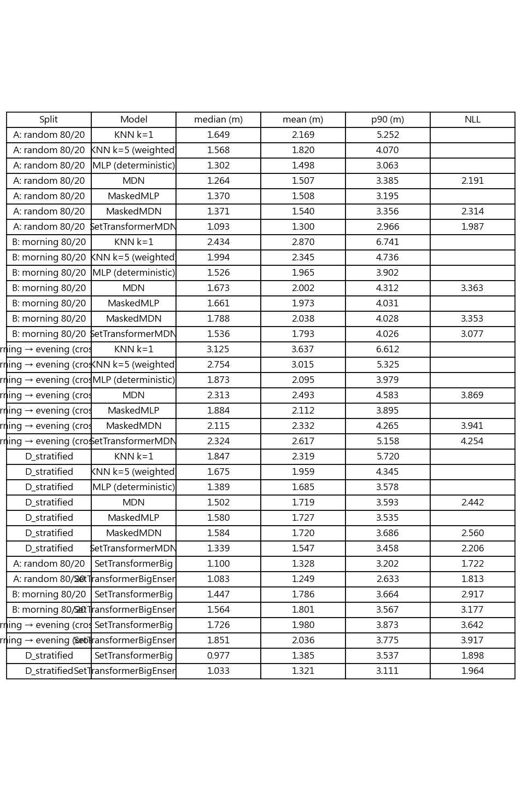

### 4.2 Error CDF — 三個 split 分別比較三模型

**A: random 80/20**
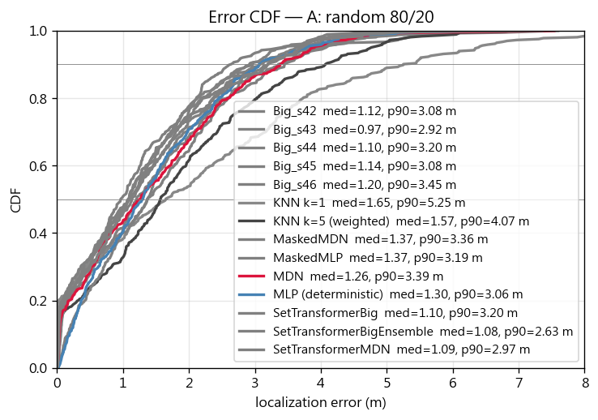

**B: morning 80/20**
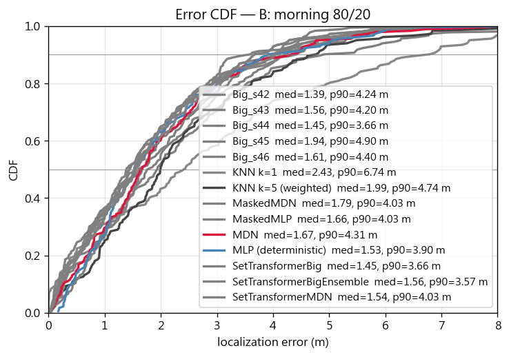

**C: morning → evening (cross-time)**
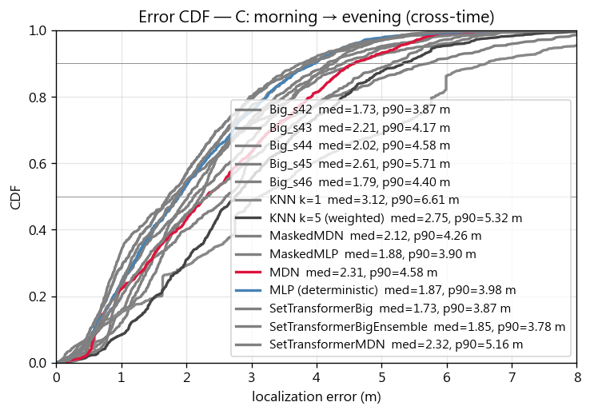

**D_stratified**
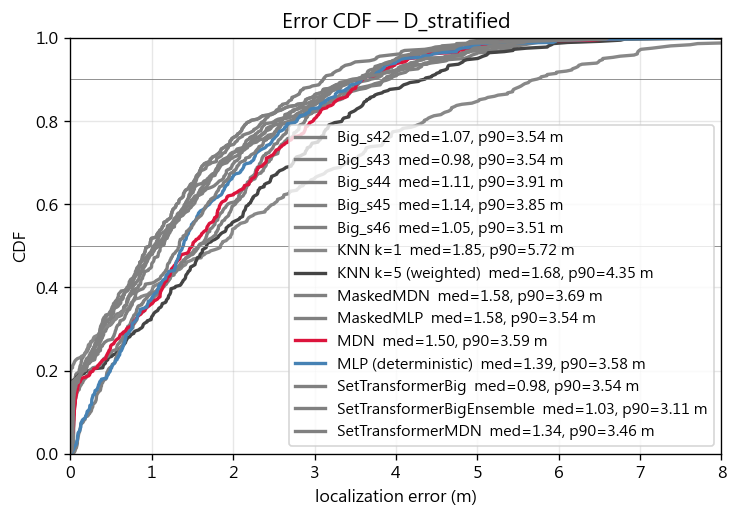

### 4.3 空間誤差分布 — 哪些區域定位差?

以 cross-time (split C) 為主,展示 KNN vs MLP vs MDN 的空間誤差熱圖:

**KNN k=5 (weighted)**
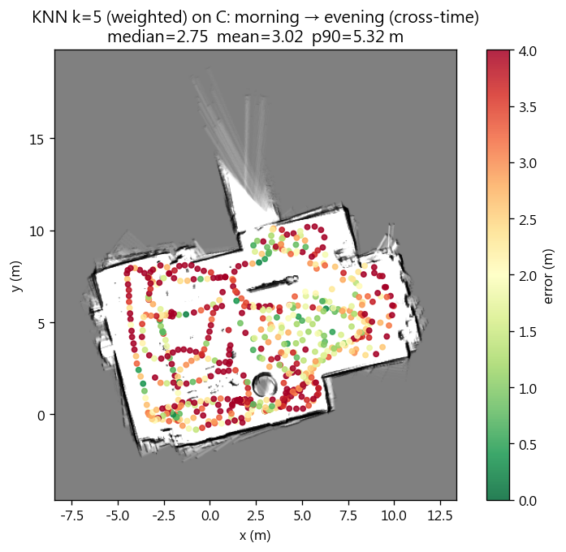

**MLP (deterministic)**
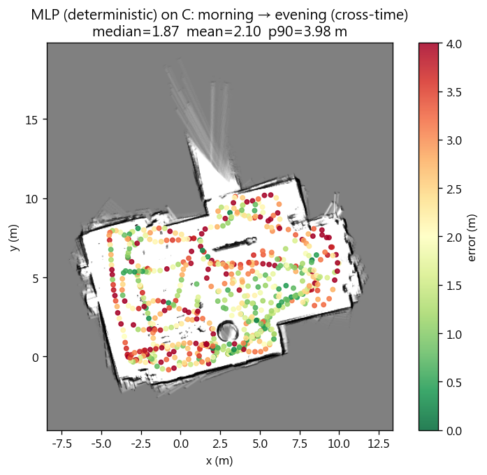

**MDN (MAP point)**

### 4.4 訓練曲線

**A: random 80/20**
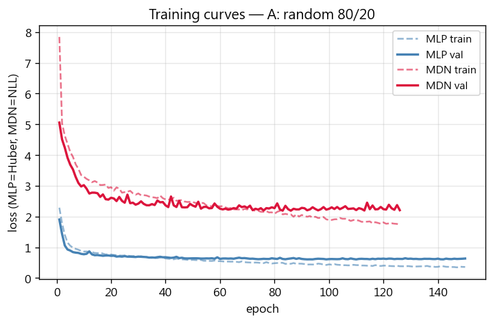

**B: morning 80/20**
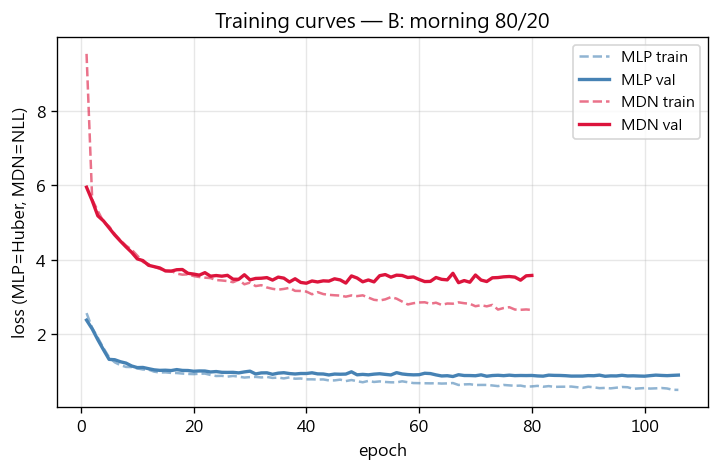

**C: morning → evening (cross-time)**
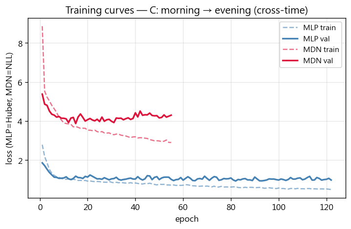

**D_stratified**
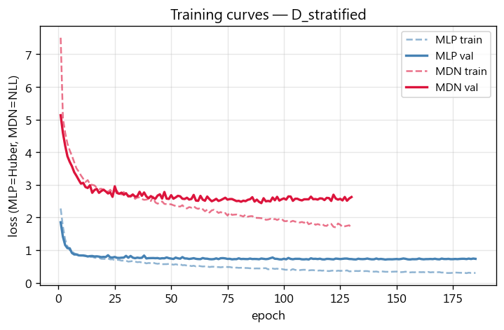

### 4.5 MDN 不確定性視覺化

挑 4 個代表性 test point(最佳 / 中位 / p90 / 最差),plot MDN 輸出的 K=3 高斯
2σ confidence ellipse + ground truth(金色星號):

**A: random 80/20**
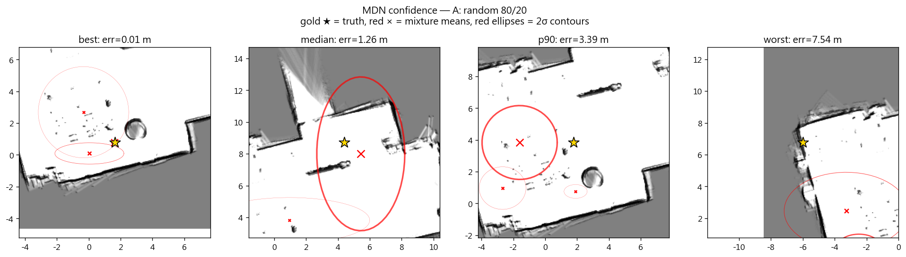

**B: morning 80/20**
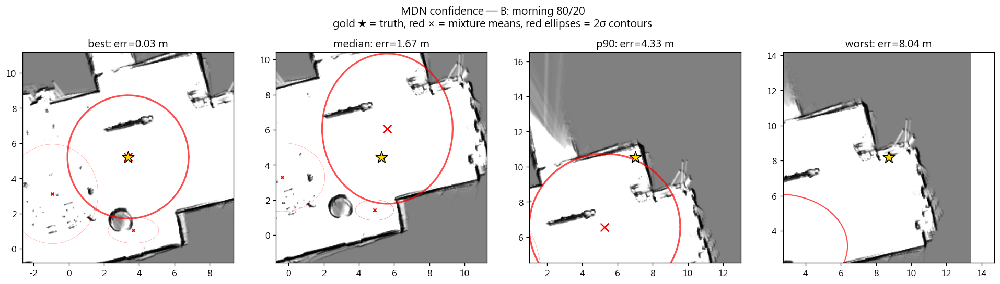

**C: morning → evening (cross-time)**
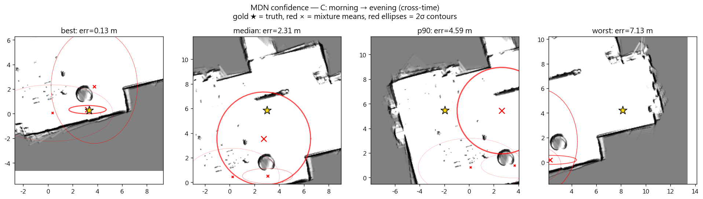

**D_stratified**
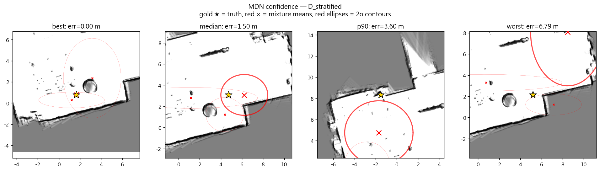

### 4.6 MDN 不確定性校準

Scatter: MDN 預測的 σ_total(取 MAP component)vs 實際定位誤差。
若 MDN 知道自己什麼時候不確定 → 兩者應該正相關。

**A: random 80/20**
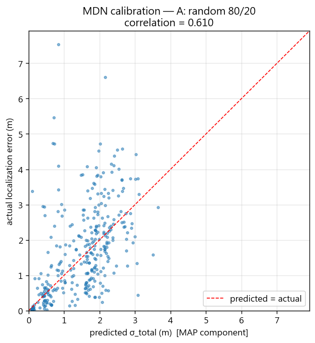

**B: morning 80/20**
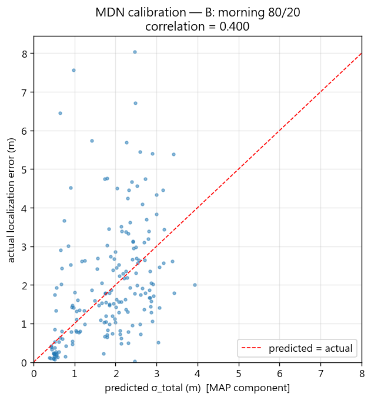

**C: morning → evening (cross-time)**
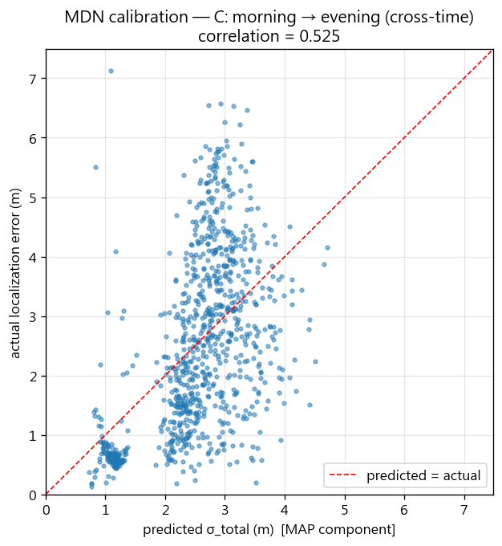

**D_stratified**
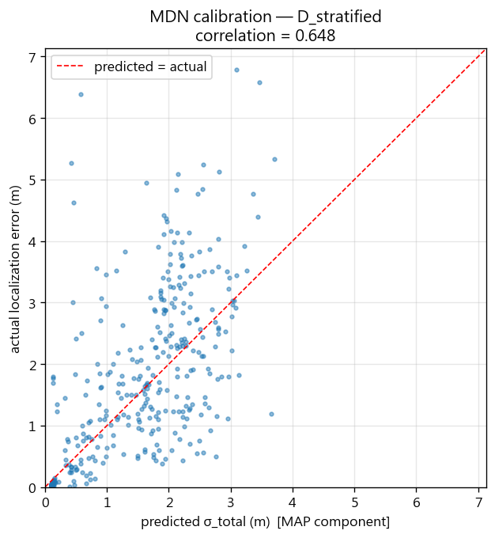

## 5. 討論

**做對的事:**
- **三方對比(KNN / MLP / MDN)+ 三 split 矩陣**:看出哪個是 architecture 帶來的進步、哪個是 split 帶來的難度
- **RSSI augmentation**:用 EDA 量化的噪聲水準反向設計 augmentation 強度,而不是憑感覺
- **Cross-time 主測**:直接接 Lab 2 發現,故事一脈相承,而非「都用 random split」這種典型偷懶評估
- **MDN uncertainty calibration**:不只報誤差,還報「模型知不知道自己錯」 — 對下游 SLAM/sensor fusion 很有用

**限制:**
- 1,812 record 在 deep learning 是很小的資料量,MLP/MDN 跟 KNN 差距有限
- 沒做主動 domain adaptation(只有 augmentation),cross-time 還是會掉
- 沒測 yaw → fingerprint 帶方向會更精確,但需要更多資料
- ESP32 一輪 scan ~3.8 s,實際定位場景應該支援更高頻率 scan

**Future work:**
- **Set Transformer**:把 scan 當 variable-size set of (BSSID_emb, RSSI) → 從根本解掉「fixed-vector + missing AP 填 -100」的尷尬
- **Contrastive pre-training**:同位置兩 scan 應 embedding 相近 → 學到 RSSI invariant 再 fine-tune (x, y)
- **Domain adversarial**:讓 backbone 學 morning/evening 不可分的特徵 → 抵抗 covariate shift
- 收集更多時段(中午 / 週末)+ 更多位置 → 真正能上線的 fingerprint database
